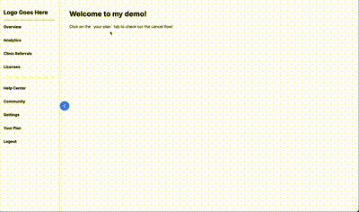

# Churnkey Technical Assessment

This Next.js project demonstrates the integration of the Churnkey cancellation flow.

## Demo 



## Table of Contents

- [Churnkey Technical Assessment](#churnkey-technical-assessment)
  - [Demo](#demo)
  - [Table of Contents](#table-of-contents)
  - [Overview](#overview)
  - [Installation](#installation)
  - [Setup](#setup)
  - [Usage](#usage)
  - [API Route](#api-route)
  - [Environment Variables](#environment-variables)
  - [Onboarding Improvements](#onboarding-improvements)

## Overview

Churnkey provides a suite of customer retention products to companies who sell their products as subscription services. This project integrates Churnkey's Cancel Flow into a hypothetical account management page using Next.js, TypeScript, and Tailwind.

## Installation

1. Clone the repository:

```bash
git clone git@github.com:c1008h/tech-support-assessment.git
cd churnkey-assessment
```

2. Install dependencies: `npm install`

```bash
npm install
```

## Setup

1. Create a '.env.local' file in the root directory and add the following environment variables:

```env.local
NEXT_PUBLIC_APP_ID=your_churnkey_api_key
NEXT_PUBLIC_CUSTOMER_ID=stripe_customer_id
CHURNKEY_API_KEY=your_churnkey_api_key
```

- Login to your Churnkey account and go to settings within your workspace.
- Scroll down to 'Cancel Flow API Keys' to find your app ID, test key, and live key.
- Use the test key as your `CHURNKEY_API_KEY` and the app ID as your `NEXT_PUBLIC_APP_ID`.

## Usage

1. Start the development server by running `npm run dev` in your terminal.
2. Open your browser to see the application, typically at [http://localhost:3000](http://localhost:3000).
3. Navigate to the 'Your Plan' tab in the sidebar. This is where you will find the cancel button to manage your subscription.

## API Route

The API route is located at `app/api/churnkey/route.ts` and is responsible for generating the HMAC hash:

## Environment Variables

- NEXT_PUBLIC_APP_ID: Your Churnkey application ID.
- NEXT_PUBLIC_CUSTOMER_ID: The customer ID for the demo customer in the test Stripe account.
- CHURNKEY_API_KEY: Your Churnkey API key.

## Onboarding Improvements

1. **Clearer Documentation for Frameworks**: The documentation should provide more detailed examples for different frameworks, including Next.js. For instance, in the provided documentation, the script tag to load the Churnkey functionality is written as:

```html
    <script>
    !function(){  
      if (!window.churnkey || !window.churnkey.created) {
        window.churnkey = { created: true };
        const a = document.createElement('script');
        a.src = 'https://assets.churnkey.co/js/app.js?appId=vupg9mh6t';
        a.async = true;
        const b = document.getElementsByTagName('script')[0];
        b.parentNode.insertBefore(a, b);
      }
    }();
    </script>
```

However, for Next.js users, especially when using the App Router, the script needs to be included with backticks within the dangerouslySetInnerHTML property like so:

```javascript
    <head>
      <script dangerouslySetInnerHTML={{ __html: `
        !function(){  
          if (!window.churnkey || !window.churnkey.created) {
            window.churnkey = { created: true };
            const a = document.createElement('script');
            a.src = 'https://assets.churnkey.co/js/app.js?appId=${churnkeyAppId}';
            a.async = true;
            const b = document.getElementsByTagName('script')[0];
            b.parentNode.insertBefore(a, b);
          }
        }();
      `}}></script>
    </head>
```

2. **Clarify Next.js Versions**: Clearly differentiate between instructions for Next.js App Router (introduced in Next.js 13+) and Pages Router. This ensures users are following the correct setup for their specific Next.js version. For example, with the App Router, use:

```javascript
import { NextRequest, NextResponse } from 'next/server';

export async function POST(request: NextRequest) {
  const { customerId } = await request.json();

  if (!customerId) {
    return NextResponse.json({ error: 'Missing customerId' }, { status: 400 });
  }

  const API_KEY = process.env.CHURNKEY_API_KEY || ""; // Your Churnkey API Key
  const userHash = crypto
    .createHmac("sha256", API_KEY)
    .update(customerId)
    .digest("hex");

  return NextResponse.json({ userHash });
}
```

3. **Streamlined Information Presentation**: The current layout for choosing between different frameworks is helpful, but it can become cluttered with information users might not need. Allowing users to select their framework first and then displaying only the relevant information for that choice would make the page cleaner and less distracting. This focused approach would enhance user experience by providing targeted and concise instructions.
4. **Starter or Demo Repository**: Some businesses might not be as tech-savvy, so being able to clone a demo repository and see how the integration is implemented could be extremely helpful. Providing a sample project repository that users can clone and run locally allows users to see a fully functioning integration and understand how everything fits together.
5. **Interactive Tutorials**: Implement interactive tutorials or video guides to help users set up the Cancel Flow more easily. Adding a step-by-step wizard or guide within the Churnkey dashboard can enhance understanding and make the process more engaging.

By incorporating these suggestions, the onboarding process can become more intuitive and user-friendly, catering to a wider range of technical proficiencies and ensuring smoother integration of Churnkey's features.
